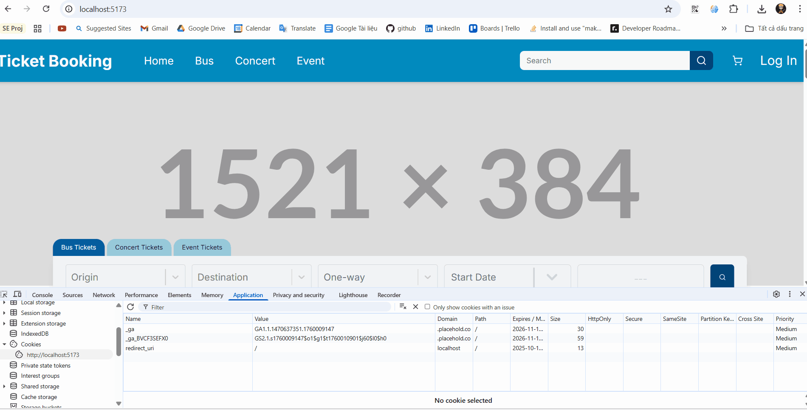
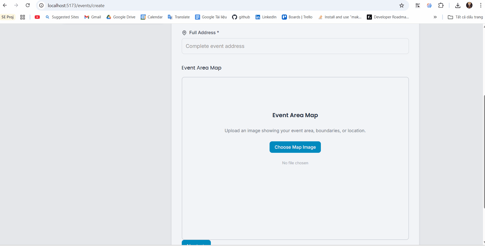
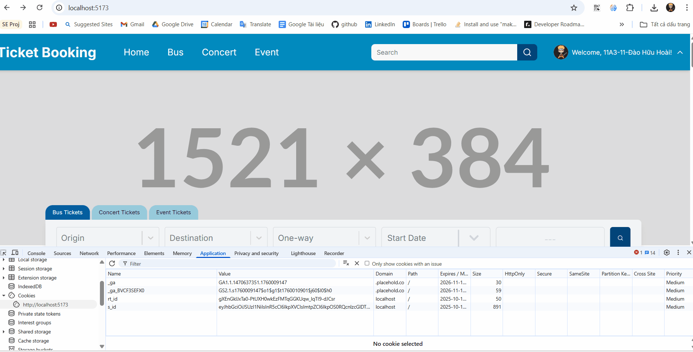

<div align="center">
  <h1 align="center">TicketBooking Frontend 🚀</h1>
  <p align="center">
    The official frontend for the TicketBooking platform, a modern web application for browsing and purchasing event tickets. Built with React, Vite, and Redux Toolkit, it features a secure authentication system and a highly optimized, component-based architecture.
  </p>
</div>

---

### 📸 Visual Demo

**Secure Login Flow**


**Interactive Seat Map Drawing Tool**


**Automatic Access Token Renewal**


---

### ✨ Key Features

#### ✅ Implemented

- **Secure Authentication Flow**:
  - Robust login/logout functionality using an OAuth 2.0 flow.
  - Automated Access Token (AT) renewal using Refresh Tokens (RT) and Axios interceptors.
  - Persistent user sessions managed securely with cookies.
- **Protected Routing**:
  - Clear separation between public and private routes.
  - Automatically fetches user information upon loading a private route.
- **Scalable Foundation**:
  - Centralized state management with Redux Toolkit.
  - Modular project structure built for maintainability and future expansion.
  - Optimized icon loading with `unplugin-icons` to ensure fast performance.

#### ⏳ Coming Soon

- **Event Discovery & Booking**: A complete interface to browse, search, and book tickets for events.
- **Shopping Cart & Checkout**: A full-featured shopping cart and multi-step checkout process.
- **User Account Management**: A dedicated dashboard for users to view their profile and booking history.
- **Full Internationalization (i18n)**: Complete language translations across the entire application.

---

### 💻 Technology Stack

| Category                 | Technology / Library                                          |
| ------------------------ | ------------------------------------------------------------- |
| **Core Framework**       | `React.js`, `Vite`                                            |
| **Language**             | `JavaScript (ES6+)`, `HTML5`, `CSS3`                          |
| **Styling**              | `Tailwind CSS`                                                |
| **State Management**     | `Redux Toolkit`                                               |
| **Routing**              | `React Router DOM`                                            |
| **API Client**           | `Axios` (with interceptors for token management)              |
| **Icons**                | `unplugin-icons` & `lucide-react` (Optimized for performance) |
| **Internationalization** | `i18next`                                                     |

---

### 🚀 Getting Started

Follow these steps to get the development environment running.

1.  **Clone the repository**:
    ```bash
    git clone https://github.com/hwHoai/ticketbooking-fe.git
    ```
2.  **Navigate to the project directory**:
    ```bash
    cd ticketbooking-fe
    ```
3.  **Install dependencies**:
    ```bash
    npm install
    ```
4.  **Set up environment variables**:
    Create a `.env` file in the root directory and add the environment config based on .env.example.
    ```env
    VITE_ENVIRONMENT = #dev
    VITE_API_ENDPOINT_URL = #http://localhost:8081/api/v1
    VITE_AUTH0_DOMAIN = #Your Auth0 Domain
    VITE_AUTH0_CLIENT_ID = #Your Auth0 Client ID
    VITE_AUTH0_AUDIENCE = #Your Auth0 Audience
    ```
5.  **Run the development server**:
    ```bash
    npm run dev
    ```
6.  **Open the application**:
    Navigate to `http://localhost:5173` in your browser.

---

### 📂 Project Structure

The project follows a modular and scalable structure, designed for clarity and maintainability.

```
src
├── assets/         # Static assets like fonts and images
├── components/     # Reusable UI components (common, layout)
├── config/         # Application-wide configurations (Axios, i18n, Redux)
├── constant/       # Application constants (routes, keys)
├── lib/            # Redux store and slices
├── route/          # Route definitions and components
├── screen/         # Top-level page components
├── service/        # API service layer for interacting with the backend
└── util/           # Utility functions (cookie handling, loggers)
```

---

### 🌐 API Endpoints

This frontend consumes a REST API provided by the backend. Here are the primary endpoints implemented:

| Method | Endpoint                            | Description                        | Auth Required  |
| :----- | :---------------------------------- | :--------------------------------- | :------------- |
| `POST` | `/api/v1/auth/login`                | Logs in a user and get code for AT | No             |
| `POST` | `/api/v1/auth/logout`               | Logs out a user.                   | No             |
| `POST` | `/api/v1/auth/access_token/${code}` | Get access token.                  | No (uses code) |
| `POST` | `/api/v1/auth/refresh-token`        | Refreshes an expired access token. | No (uses RT)   |
| `GET`  | `/api/v1/user/info`                 | Gets the current user's info.      | Yes            |

> **Note**: "Auth Required: Yes" implies that a valid **Access Token (AT)** must be included in the request header. "Use RT" means a valid **Refresh Token (RT)** is needed for that specific operation. Code is the auth code given on the callback url when login.

---

### 🔗 Backend Repository

The backend for this project can be found at the following repository:
[**https://github.com/hwHoai/ticketbooking-be**](https://github.com/hwHoai/ticketbooking-be)
